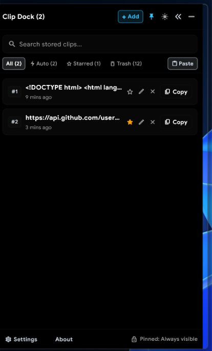

# Clip Dock (cNote)

A sleek, lightweight, and modern screen-edge clipboard manager for Windows built with Flutter.

---

## Features

- **Screen-Edge Auto-Dock**: Glides smoothly into the screen edge when not in use, opening instantly on mouse hover or ribbon handle tap.
- **Pure AMOLED Dark Mode & Glass Light Mode**: Crafted with deep pitch-black (`#000000`) surfaces, customizable acrylic blur, and opacity sliders.
- **Auto Clipboard Capture**: Dedicated **Auto** tab that automatically detects copied items across Windows and moves them to the **All** tab on copy.
- **Smart Organization**: Tabs for **All**, **Auto**, **Starred**, and **Trash** with live counters and search filters.
- **Position & Screen Edge Alignment**: Fine-tune screen edge position left or right in real-time with `-` / `+` micro-steppers.
- **Windows Startup Integration**: Launch automatically on system startup with persisted user preferences.
- **Local & Offline Storage**: Fast, persistent storage stored locally on your machine in `%APPDATA%\Cnote`.

---

## Screenshots

| Full Dock Interface | Edge Ribbon / Collapsed |
| :---: | :---: |
|  |  |

---

## Download & Installation

### Option 1: Installer (Recommended)
Download the latest `ClipDock-Setup-v1.0.0.exe` from the [Releases](https://github.com/mahtab-jack/ClipDock/releases) page and run the installer.

### Option 2: Portable ZIP
Download `ClipDock-v1.0.0-Windows.zip`, extract the folder anywhere on your PC, and launch `cnote.exe`.

---

## Building from Source

### Prerequisites
- [Flutter SDK](https://flutter.dev/docs/get-started/install/windows) (v3.13+)
- Visual Studio 2022 with Desktop development with C++

### Build Steps
```bash
# 1. Clone repository
git clone https://github.com/mahtab-jack/ClipDock.git
cd ClipDock

# 2. Get dependencies
flutter pub get

# 3. Build Windows release executable
flutter build windows
```

The compiled release will be located at:
`build\windows\x64\runner\Release\`

---

## Developer

Developed with precision by **[Mahtab Jack](https://github.com/mahtab-jack)**.

---

## License

This project is licensed under the MIT License.
